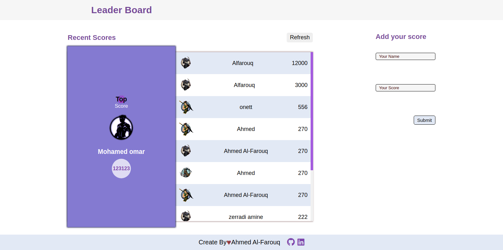

# LeaderBoard

This is an awesome Leader Board

You can add your score and name. Compare yours with others

# Built With
* HTML 5
* CSS 3
* JS & ECMA 6
* Webpack
* Linters(webhint, stylelint, eslint)

# Get started
1) Open your command
2) Type "git clone https://github.com/ahmed-al-farouq/LeaderBoard.git"
3) npm i
4) npm run start

# Live Demo
[Live-Dome](https://ahmed-al-farouq.github.io/LeaderBoard/)

# Prerequisites
You need to know:
* HTML
* CSS
* JS
* Webpack

# Setup
1) Open command line
2) Type "git clone https://github.com/ahmed-al-farouq/LeaderBoard.git"
3) npm i webpack webpack-cli webpack-dev-server --save-dev
4) npm run start
5) Enjoy!

# Authors
:bearded_person: **Ahmed Omar**
  - Github: [@Ahmed-Alfarouq](https://github.com/ahmed-al-farouq)
  - LinkedIn: [LinkedIn](https://www.linkedin.com/in/ahmed-al-farouq/)
  - Twitter: [@twitter](https://twitter.com/ahmed_al_farouq)

## 🤝 Contributing

Contributions, issues, and feature requests are welcome!

Feel free to check the [issues page](../../issues/).

## Show your support

Give a ⭐️ if you like this project!

## 📝 License

This project is [MIT](./MIT.md) licensed.
